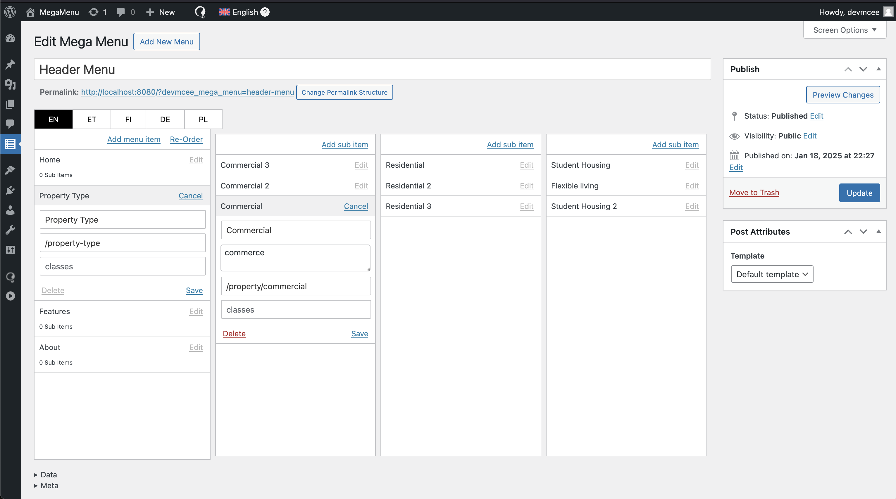
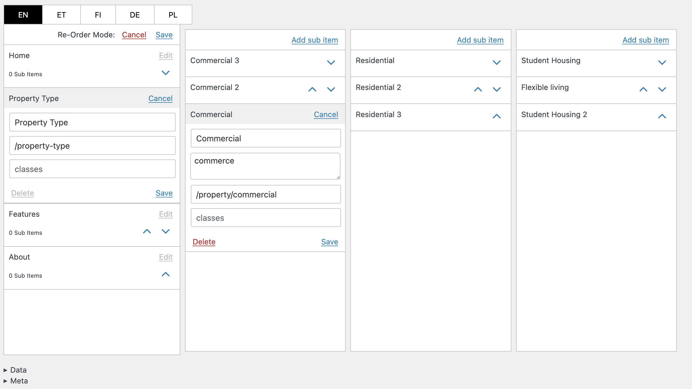
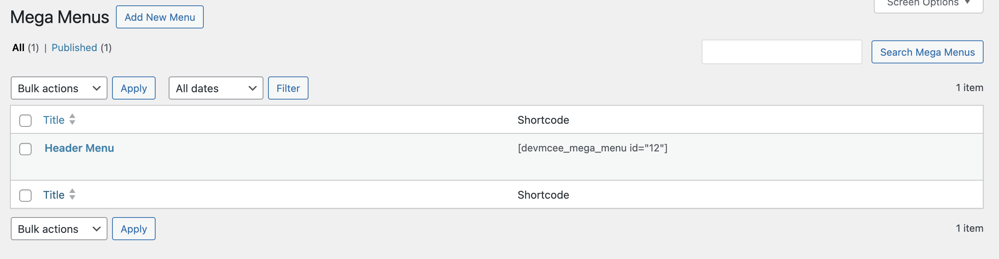
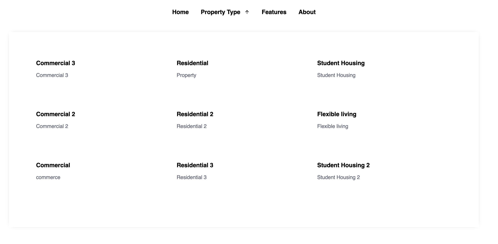
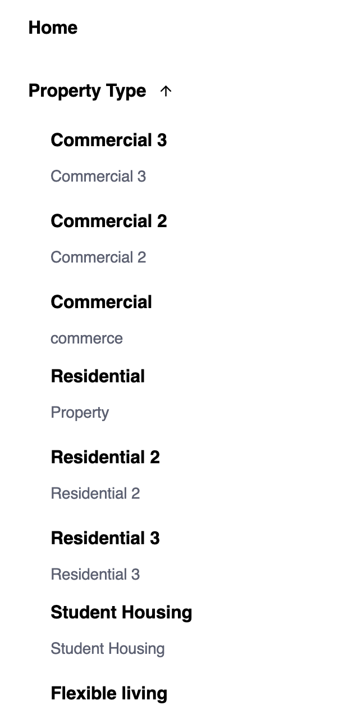

# Mega Menu - WP Plugin (+React)

A lightweight Mega Menu plugin for WordPress.

This plugin introduces a custom post type, `devmcee_mega_menu`, which stores the menu structure. The structure is parsed and rendered on the frontend using a shortcode.

If `WPML` is installed, the Mega Menu will display all active languages for translation. However, translations are stored within the post meta.

Each menu consists of Menu Items and Sub Menu Items, which are displayed in a dropdown block with a three-column layout. Sub Menu Items include a description.

On mobile devices, the menu adopts an accordion-style layout for better usability.

All Menu Items and Sub Menu Items can be edited, deleted, and reordered. However, only empty Menu Items can be deleted.

### Admin - menu edit mode


### Admin - menu re-order mode


### Admin - menu list - shortcode


### Front - desktop


### Front - Mobile


<details>
  <summary>Data Example</summary>

  ```json
  {
    "subMenuItems": {
      "10ec7a7b-b85d-4fe7-90d8-fa1ac00a7cde": {
        "url": "/property/commercial",
        "description": "commerce",
        "title": "Commercial",
        "columnIndex": 0,
        "subMenuItemsColumnsUuid": "b2ecbe9b-e903-4fe3-b19c-d48e025d13a0",
        "uuid": "10ec7a7b-b85d-4fe7-90d8-fa1ac00a7cde"
      },
      "a8c001ec-4384-40c0-98c1-24976d3fd215": {
        "url": "/property/residential",
        "description": "Property",
        "title": "Residential",
        "columnIndex": 1,
        "subMenuItemsColumnsUuid": "b2ecbe9b-e903-4fe3-b19c-d48e025d13a0",
        "uuid": "a8c001ec-4384-40c0-98c1-24976d3fd215"
      },
      "f737c4e3-343f-494e-90a3-35207817cef9": {
        "url": "/property/Commercial-2",
        "description": "Commercial 2",
        "title": "Commercial 2",
        "columnIndex": 0,
        "subMenuItemsColumnsUuid": "b2ecbe9b-e903-4fe3-b19c-d48e025d13a0",
        "uuid": "f737c4e3-343f-494e-90a3-35207817cef9"
      },
      "0a17d28b-c453-4071-9dc7-2110651677d4": {
        "url": "/residential-2",
        "description": "Residential 2",
        "title": "Residential 2",
        "columnIndex": 1,
        "subMenuItemsColumnsUuid": "b2ecbe9b-e903-4fe3-b19c-d48e025d13a0",
        "uuid": "0a17d28b-c453-4071-9dc7-2110651677d4"
      },
      "f59e3e56-fe90-4e75-9db1-e37008ab00ce": {
        "url": "/student-housing",
        "description": "Student Housing",
        "title": "Student Housing",
        "columnIndex": 2,
        "subMenuItemsColumnsUuid": "b2ecbe9b-e903-4fe3-b19c-d48e025d13a0",
        "uuid": "f59e3e56-fe90-4e75-9db1-e37008ab00ce"
      },
      "be0bc3c2-086d-46a1-afc8-887cbe36081d": {
        "url": "/flexible-living",
        "description": "Flexible living",
        "title": "Flexible living",
        "columnIndex": 2,
        "subMenuItemsColumnsUuid": "b2ecbe9b-e903-4fe3-b19c-d48e025d13a0",
        "uuid": "be0bc3c2-086d-46a1-afc8-887cbe36081d"
      },
      "57e41e46-7ccc-4a79-bc3a-0e65cdf695d6": {
        "url": "/commercial-3",
        "description": "Commercial 3",
        "title": "Commercial 3",
        "columnIndex": 0,
        "subMenuItemsColumnsUuid": "b2ecbe9b-e903-4fe3-b19c-d48e025d13a0",
        "uuid": "57e41e46-7ccc-4a79-bc3a-0e65cdf695d6"
      },
      "b778a50b-3a26-413d-890c-acdccd3d9e64": {
        "url": "/residential-3",
        "description": "Residential 3",
        "title": "Residential 3",
        "columnIndex": 1,
        "subMenuItemsColumnsUuid": "b2ecbe9b-e903-4fe3-b19c-d48e025d13a0",
        "uuid": "b778a50b-3a26-413d-890c-acdccd3d9e64"
      },
      "681476a0-21be-4787-8b12-8446772cdc2a": {
        "url": "/student-housing-2",
        "description": "Student Housing 2",
        "title": "Student Housing 2",
        "columnIndex": 2,
        "subMenuItemsColumnsUuid": "b2ecbe9b-e903-4fe3-b19c-d48e025d13a0",
        "uuid": "681476a0-21be-4787-8b12-8446772cdc2a"
      },
      "b33df729-401f-4b1f-b621-ab82226b9bc8": {
        "url": "/commercial-et",
        "description": "commercial et",
        "title": "Ärikinnisvara",
        "columnIndex": 0,
        "subMenuItemsColumnsUuid": "d2b67899-baf5-43df-9416-6789bf10497c",
        "uuid": "b33df729-401f-4b1f-b621-ab82226b9bc8"
      },
      "e466b075-95d3-4d74-b5ad-7d2e14584103": {
        "url": "/commercial2-et",
        "description": "Ärikinnisvara 2",
        "title": "Ärikinnisvara 2",
        "columnIndex": 0,
        "subMenuItemsColumnsUuid": "d2b67899-baf5-43df-9416-6789bf10497c",
        "uuid": "e466b075-95d3-4d74-b5ad-7d2e14584103"
      },
      "7405f936-9840-4099-963b-6c34ccd8840e": {
        "url": "/commercial-3",
        "description": "Ärikinnisvara 3",
        "title": "Ärikinnisvara 3",
        "columnIndex": 0,
        "subMenuItemsColumnsUuid": "d2b67899-baf5-43df-9416-6789bf10497c",
        "uuid": "7405f936-9840-4099-963b-6c34ccd8840e"
      },
      "53cd19d7-807c-4cf4-9732-05f9ae3166a5": {
        "url": "/co-living",
        "description": "Co-living",
        "title": "Co-living",
        "columnIndex": 1,
        "subMenuItemsColumnsUuid": "d2b67899-baf5-43df-9416-6789bf10497c",
        "uuid": "53cd19d7-807c-4cf4-9732-05f9ae3166a5"
      },
      "b2ea7142-bba4-4711-9c01-1a1e57b8d13a": {
        "url": "/co-living-2",
        "description": "Co-living 2",
        "title": "Co-living 2",
        "columnIndex": 1,
        "subMenuItemsColumnsUuid": "d2b67899-baf5-43df-9416-6789bf10497c",
        "uuid": "b2ea7142-bba4-4711-9c01-1a1e57b8d13a"
      },
      "f7b393a3-9a62-4990-9912-55c6561761aa": {
        "url": "/co-living-3",
        "description": "Co-living 3",
        "title": "Co-living 3",
        "columnIndex": 1,
        "subMenuItemsColumnsUuid": "d2b67899-baf5-43df-9416-6789bf10497c",
        "uuid": "f7b393a3-9a62-4990-9912-55c6561761aa"
      },
      "cdea67f6-03e4-416a-8b0e-e4d8cb222a7e": {
        "url": "/student-housing",
        "description": "Üliõpilaselamud",
        "title": "Üliõpilaselamud",
        "columnIndex": 2,
        "subMenuItemsColumnsUuid": "d2b67899-baf5-43df-9416-6789bf10497c",
        "uuid": "cdea67f6-03e4-416a-8b0e-e4d8cb222a7e"
      },
      "0fe621a0-b591-432e-aa9e-5bc6ea358e08": {
        "url": "/student-housing-2",
        "description": "Üliõpilaselamud 2",
        "title": "Üliõpilaselamud 2",
        "columnIndex": 2,
        "subMenuItemsColumnsUuid": "d2b67899-baf5-43df-9416-6789bf10497c",
        "uuid": "0fe621a0-b591-432e-aa9e-5bc6ea358e08"
      },
      "3fff2543-74c2-4958-9e6b-5afcee24510e": {
        "url": "/student-housing-3",
        "description": "Üliõpilaselamud 3",
        "title": "Üliõpilaselamud 3",
        "columnIndex": 2,
        "subMenuItemsColumnsUuid": "d2b67899-baf5-43df-9416-6789bf10497c",
        "uuid": "3fff2543-74c2-4958-9e6b-5afcee24510e"
      }
    },
    "menuItems": {
      "f60f7e84-bf6b-49bb-af52-1e6fd3c1c553": {
        "languageCode": "en",
        "title": "Home",
        "url": "/home",
        "subMenuItemsColumnsUuid": "28b0c99c-8a84-49d1-9a6f-dcd540bd9214",
        "uuid": "f60f7e84-bf6b-49bb-af52-1e6fd3c1c553"
      },
      "958a93d0-afcc-4be2-bc9a-5a7261151069": {
        "languageCode": "en",
        "title": "Property Type",
        "url": "/property-type",
        "subMenuItemsColumnsUuid": "b2ecbe9b-e903-4fe3-b19c-d48e025d13a0",
        "uuid": "958a93d0-afcc-4be2-bc9a-5a7261151069"
      },
      "06145c19-47d7-4057-9afa-90b65fa639dc": {
        "languageCode": "en",
        "title": "Features",
        "url": "/features",
        "subMenuItemsColumnsUuid": null,
        "uuid": "06145c19-47d7-4057-9afa-90b65fa639dc"
      },
      "e28b796e-6091-40ea-b2fb-64734c66e3a4": {
        "languageCode": "en",
        "title": "About",
        "url": "/about",
        "subMenuItemsColumnsUuid": null,
        "uuid": "e28b796e-6091-40ea-b2fb-64734c66e3a4"
      },
      "1f4b71c7-5438-43e9-bdcc-f8806f4a92af": {
        "languageCode": "et",
        "title": "Pealeht",
        "url": "/home-et",
        "subMenuItemsColumnsUuid": null,
        "uuid": "1f4b71c7-5438-43e9-bdcc-f8806f4a92af"
      },
      "44b8b831-6cde-4448-a9ad-d5a2519386df": {
        "languageCode": "et",
        "title": "Kinnisvara tüüp",
        "url": "/property-type-et",
        "subMenuItemsColumnsUuid": "d2b67899-baf5-43df-9416-6789bf10497c",
        "uuid": "44b8b831-6cde-4448-a9ad-d5a2519386df"
      },
      "eff8d3ae-7e99-4479-83fb-23f1db293e84": {
        "languageCode": "et",
        "title": "Võimalused",
        "url": "/features-et",
        "subMenuItemsColumnsUuid": null,
        "uuid": "eff8d3ae-7e99-4479-83fb-23f1db293e84"
      },
      "99599461-23ce-49c5-9b7a-b2c325398dbd": {
        "languageCode": "et",
        "title": "Meist",
        "url": "/about-et",
        "subMenuItemsColumnsUuid": null,
        "uuid": "99599461-23ce-49c5-9b7a-b2c325398dbd"
      }
    },
    "localMenu": {
      "en": [
        "f60f7e84-bf6b-49bb-af52-1e6fd3c1c553",
        "958a93d0-afcc-4be2-bc9a-5a7261151069",
        "06145c19-47d7-4057-9afa-90b65fa639dc",
        "e28b796e-6091-40ea-b2fb-64734c66e3a4"
      ],
      "et": [
        "1f4b71c7-5438-43e9-bdcc-f8806f4a92af",
        "44b8b831-6cde-4448-a9ad-d5a2519386df",
        "eff8d3ae-7e99-4479-83fb-23f1db293e84",
        "99599461-23ce-49c5-9b7a-b2c325398dbd"
      ],
      "fi": [],
      "de": [],
      "pl": []
    },
    "subMenuItemsColumns": {
      "28b0c99c-8a84-49d1-9a6f-dcd540bd9214": [
        [],
        [],
        []
      ],
      "b2ecbe9b-e903-4fe3-b19c-d48e025d13a0": [
        [
          "57e41e46-7ccc-4a79-bc3a-0e65cdf695d6",
          "f737c4e3-343f-494e-90a3-35207817cef9",
          "10ec7a7b-b85d-4fe7-90d8-fa1ac00a7cde"
        ],
        [
          "a8c001ec-4384-40c0-98c1-24976d3fd215",
          "0a17d28b-c453-4071-9dc7-2110651677d4",
          "b778a50b-3a26-413d-890c-acdccd3d9e64"
        ],
        [
          "f59e3e56-fe90-4e75-9db1-e37008ab00ce",
          "be0bc3c2-086d-46a1-afc8-887cbe36081d",
          "681476a0-21be-4787-8b12-8446772cdc2a"
        ]
      ],
      "3616e219-444d-4429-94c5-66c828b37670": [
        [],
        [],
        []
      ],
      "c1f558fd-6438-436f-ad4a-f8b722fc8543": [
        [],
        [],
        []
      ],
      "d2b67899-baf5-43df-9416-6789bf10497c": [
        [
          "b33df729-401f-4b1f-b621-ab82226b9bc8",
          "e466b075-95d3-4d74-b5ad-7d2e14584103",
          "7405f936-9840-4099-963b-6c34ccd8840e"
        ],
        [
          "53cd19d7-807c-4cf4-9732-05f9ae3166a5",
          "b2ea7142-bba4-4711-9c01-1a1e57b8d13a",
          "f7b393a3-9a62-4990-9912-55c6561761aa"
        ],
        [
          "cdea67f6-03e4-416a-8b0e-e4d8cb222a7e",
          "0fe621a0-b591-432e-aa9e-5bc6ea358e08",
          "3fff2543-74c2-4958-9e6b-5afcee24510e"
        ]
      ]
    }
  }
  ```
</details>

<details>
  <summary>Meta Example</summary>

  ```json
  {
    "languages": [
      "en",
      "et",
      "fi",
      "de",
      "pl"
    ],
    "defaultLanguage": "en",
    "activeLanguageTab": "en",
    "endpoints": {
      "save": "http://localhost:8080/index.php?rest_route=/devmcee-mega-menu/v2/save"
    },
    "customNonce": "f3337de404",
    "postID": "12",
    "orderModeEnabled": false,
    "orderSubmitted": false
  }
  ```
</details>